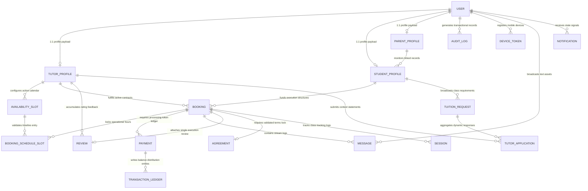
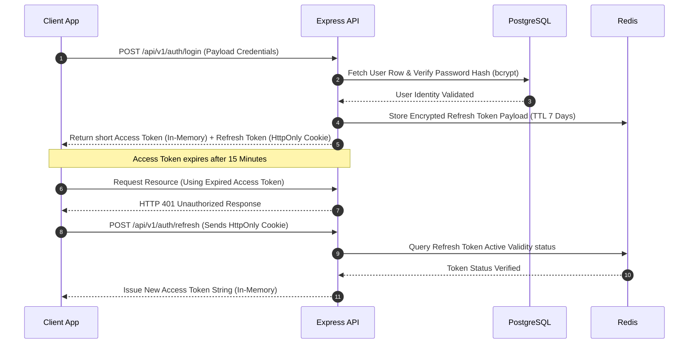
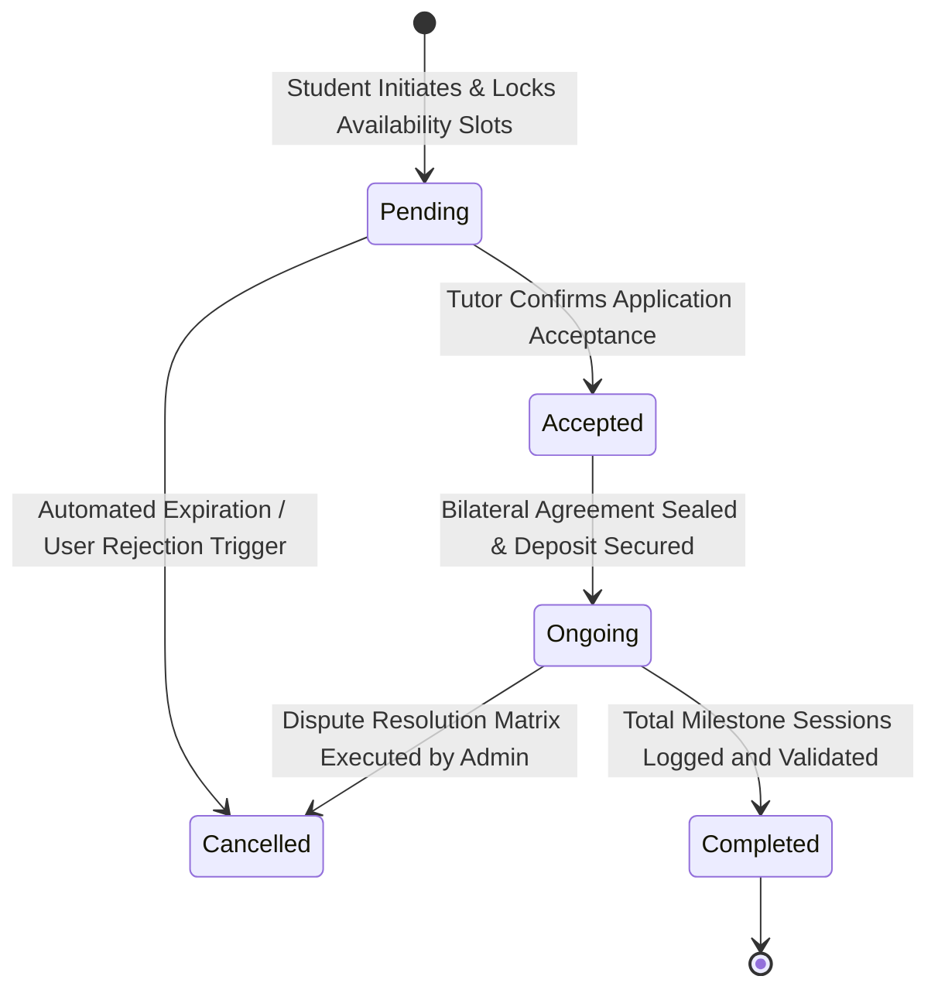
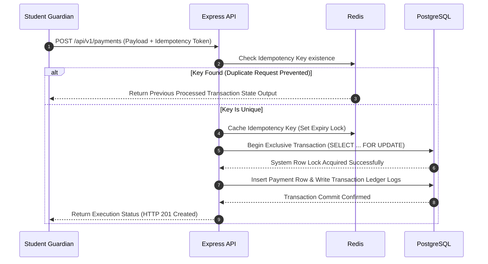
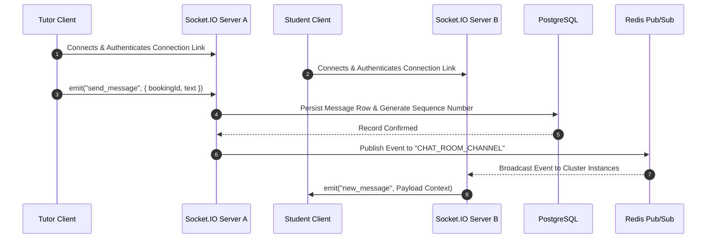
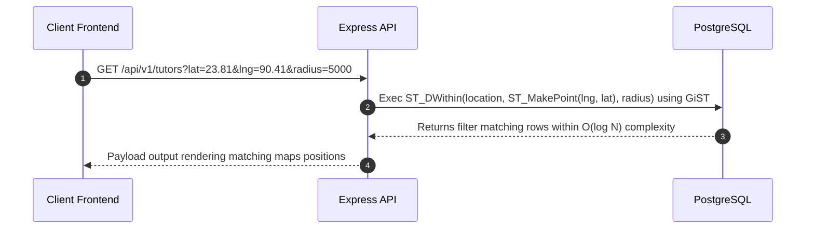

# MENTORLY (TUTORMAP) ARCHITECTURE AUDIT & PRODUCTION READINESS REPORT

**System Designation:** Enterprise-Grade Architecture Blueprint

**Target Market:** Bangladesh EdTech Marketplace

**Author:** Senior Software Architect & Principal Engineer

---

## 1. Executive Summary & Module Readiness Ratings

Before a single line of code is written for **Mentorly**, the architectural foundation must be reinforced. This audit identifies deep-seated structural issues in the initial Product Requirements Document (PRD)  and database design that would cause data corruption, security breaches, and performance degradation under load.

### 1.1 Module Readiness Matrix

The following evaluation rates the production readiness of each planned system component from 1–10, highlighting the architectural bottlenecks that must be resolved prior to development.

| System Module | Readiness Rating (1–10) | Critical Architectural Bottlenecks Identified |
| --- | --- | --- |
| **Authentication & Multi-role Management** | **3/10** | Stateless JWT token theft vulnerability; lack of token revocation mechanism; insecure user-profile link architecture. |
| **Database, Normalization & Integrity** | **2/10** | Un-normalized schedule strings; lack of soft-deletes; lack of monetary audit trails; risk of table-rebuild locks on Enum changes. |
| **Payment Architecture** | **2/10** | Race conditions during manual verification; missing transaction locks; double-spend risk; no protection against idempotency failures. |
| **Real-time Chat & WebSockets** | **4/10** | Memory-leaks in single-instance Socket.IO; unpredictable timeline sorting due to non-sequential CUID sorting under concurrency. |
| **Search, Filtering & Geolocation** | **3/10** | Performance hits from unindexed text arrays (`String[]`); $N+1$ query issues on bounding-box coordinate lookups. |
| **File Upload System** | **4/10** | Express main-thread blocking during upload; orphaned Cloudinary assets; absence of magic-byte file signature validation. |
| **Booking & Attendance Workflow** | **3/10** | Lack of distributed state machines; race conditions on overlapping availability slots; no protection against double-booking. |

---

## 2. Deep-Dive Architecture Audit & Root Cause Analysis

### 2.1 Product Architecture & SaaS Readiness

* **The Problem:** The current model links users directly to a single localized database instance with tightly coupled regional schemas. It lacks tenant isolation or localized configuration overrides, making it impossible to scale white-label variants of the marketplace to alternative emerging markets without a full code rewrite.
* **Production-Grade Solution:** Abstract all system core parameters into an isolated operational metadata context. Introduce a global system configuration tier separating tenant definitions, localized country prefixes (`+880`), currency scales (`BDT`), and tax rates.
* **Cascading Impacts:**
* *Database:* Requires the addition of an organization/tenant identification string across all top-level operational structures.
* *Backend:* Core business logic must extract regional formatting, currency symbols, and area metadata from an active configuration service rather than hardcoding local values.
* *Frontend:* Localized UI copy and field validations must adapt dynamically to the tenant configuration.
* *Future Scalability:* Enables high-density horizontal scaling, allowing new target configurations to launch by deploying a single database seed row.


### 2.2 Database, Normalization & Data Integrity

* 
**The Problem:** The schema stores complex schedules as raw strings (e.g., `'10:00-11:00 Mon,Wed,Fri'`). This makes it impossible to query open slots via SQL, verify schedule overlaps, or prevent double-bookings at the database level. Additionally, hard deletes on critical tables (`AvailabilitySlot`, `Review`, `TuitionRequest`) will destroy foreign keys and compromise historical audit trails.


* **Production-Grade Solution:** Completely normalize schedules into an explicit relational table (`BookingScheduleSlot`). Replace hard deletes with a standardized soft-delete paradigm across all models, implementing structural global query filters (`deletedAt IS NULL`).
* **Cascading Impacts:**
* *Database:* Introduction of dynamic foreign key constraints, temporal indexes, and specific audit tables.
* *Backend:* Every data mutation query must switch from a destructive `delete` command to an incremental transactional record update.
* *Frontend:* The interface must handle soft-deleted resources gracefully without throwing runtime null pointer errors.
* *Future Scalability:* Ensures data integrity and provides data warehouses with a complete historical audit trail for machine learning and behavior analysis.


### 2.3 Authentication, Authorization & Multi-role Management

* 
**The Problem:** The design uses a stateless JWT token system without a server-side revocation mechanism. If a token is stolen, an attacker retains full access until expiration. Furthermore, the `User` table relies on an optional 1:1 relation to profile models (`tutorProfile`, `studentProfile`). If role guards are misconfigured, a user could bypass logic controls and create both profiles simultaneously, violating business rules.


* **Production-Grade Solution:** Deploy a dual-token framework (short-lived access tokens + secure, HttpOnly, Redis-backed refresh tokens). Implement explicit database check constraints and composite database validations to guarantee profile exclusivity based on the assigned user role.
* **Cascading Impacts:**
* *Database:* Add concrete unique key assertions across conditional reference points.
* *Backend:* Build a Redis cache interceptor to validate token integrity on every authenticated request.
* *Frontend:* Implement silent auto-refresh mechanisms via Axios interceptors to keep users authenticated seamlessly.
* *Future Scalability:* Provides instant session-termination capabilities across all client devices simultaneously in the event of an identity compromise.


### 2.4 API Design & Future Mobile App Support

* 
**The Problem:** Routes lack API versioning paths, request payload validations, and idempotency guarantees. Exposing raw relational IDs (`cuid()`) directly within endpoint URLs  leaks internal entity volumes and leaves the system vulnerable to scraping attacks via predictable identifier manipulation.


* **Production-Grade Solution:** Enforce global version prefixing (`/api/v1/...`). Secure raw relational keys behind encrypted Public Obfuscation Tokens (`UUIDv4`). Mandate type-safe payload validation using Zod schemas at the middleware boundary.
* **Cascading Impacts:**
* *Database:* Map an alternative indexing key column (`publicId`) configured to auto-generate secure tokens on row creation.
* *Backend:* Middleware must catch, parse, and validate incoming requests before passing control to internal route controllers.
* *Frontend:* API request clients must map endpoints to the versioned paths and pass unique idempotency tokens during data mutations.
* *Future Scalability:* Decouples client-side interfaces from backend logic changes, allowing old mobile application builds to remain functional alongside new API version rollouts.


### 2.5 File Upload System

* 
**The Problem:** Processing file streams directly within Express server memory via standard Multer configurations  blocks the single-threaded Node.js event loop during large uploads. It also exposes the server to Denial of Service (DoS) attacks from large files. Furthermore, the system lacks file verification, relying only on user-declared extensions instead of checking true magic-byte file signatures.


* **Production-Grade Solution:** Transition to a secure pre-signed upload signature architecture. The frontend requests an ephemeral, signed token from the backend, uploading media assets directly to a secure Cloudinary sandbox bucket. The backend then verifies the asset metadata via an automated asynchronous webhook.

```
+----------+              +---------------+             +------------+
| Frontend |              | Express API   |             | Cloudinary |
+----+-----+              +-------+-------+             +-----+------+
     |                            |                           |
     | 1. Request Upload Token    |                           |
     |--------------------------->|                           |
     |                            |                           |
     | 2. Return Pre-signed URL   |                           |
     |<---------------------------|                           |
     |                            |                           |
     | 3. Direct Binary Upload (Event Loop is Safe)           |
     |-------------------------------------------------------->|
     |                            |                           |
     | 4. Return Secure Asset ID  |                           |
     |<-------------------------------------------------------|
     |                            |                           |
     | 5. Submit Entity Payload (Asset ID Included)           |
     |--------------------------->|                           |
     |                            |                           |
     |                            | 6. Fire Secure Webhook    |
     |                            |<--------------------------|

```

* **Cascading Impacts:**
* *Database:* Add explicit status tracking fields (`isProcessed`, `fileSize`, `mimeType`) to handle asset validation states.
* *Backend:* Remove file stream processing logic from route handlers; build webhook confirmation receivers to handle asset processing.
* *Frontend:* Integrate upload orchestration mechanics to pipe files directly to Cloudinary endpoints before completing form submissions.
* *Future Scalability:* Completely isolates heavy binary input/output operations from the API runtime, keeping response times consistent during peak usage.


### 2.6 Payment Architecture

* 
**The Problem:** Relying on manual screenshot uploads for bKash/Nagad transactions  without transactional locking mechanisms creates significant financial risk. Concurrent requests can exploit race conditions to reference a single transaction ID across multiple bookings, leading to financial data corruption.


* **Production-Grade Solution:** Implement an isolation ledger system. Wrap validation workflows in strict database transactions using PostgreSQL `SELECT ... FOR UPDATE` row locks. Apply unique multi-column database constraints across fields to prevent transaction ID reuse.
* **Cascading Impacts:**
* *Database:* Table schemas require composite unique index patterns: `UNIQUE(method, transactionId)`.
* *Backend:* Financial routes must run inside explicit database transaction blocks (`prisma.$transaction`).
* *Frontend:* Implement defensive UI micro-interactions, disabling submission fields instantly upon click to prevent double-submits.
* 
*Future Scalability:* Simplifies future compliance audits and allows the system to scale smoothly into automated payment gateways (like SSLCommerz V2)  without structural schema changes.


### 2.7 Real-time Chat & WebSockets Architecture

* 
**The Problem:** Running a default Socket.IO instance directly inside a single Express process  fails when horizontally scaling to multiple server containers. WebSocket connections drop because state data is stored in local memory, meaning instances cannot broadcast events to users connected to different servers.


* **Production-Grade Solution:** Decouple connection management from the application state by deploying a central Redis Pub/Sub backend broker utilizing the official `@socket.io/redis-adapter`.
* **Cascading Impacts:**
* *Database:* Add sequence cursors (`BigInt`) to chat tables to guarantee correct message rendering orders across distributed instances.
* *Backend:* Redesign initialization layers to connect Socket.IO processes to distributed Redis message channels.
* *Frontend:* Build automatic reconnection and exponential backoff strategies into the frontend socket manager client.
* *Future Scalability:* Allows full horizontal scaling across multiple container layers, accommodating thousands of concurrent chat sessions seamlessly.


### 2.8 Search, Filtering, Geolocation & Map Architecture

* 
**The Problem:** Storing location data as raw floating-point numbers (`latitude`, `longitude`) and filtering criteria through primitive text arrays (`String[]`)  causes significant performance degradation at scale. Querying these structures requires full table scans that bypass traditional indexes, leading to high CPU usage as the database grows.


* **Production-Grade Solution:** Enable the PostGIS spatial database extension within PostgreSQL. Convert raw location columns into native `GEOGRAPHY(Point, 4326)` coordinate types and index them using spatial GIST index structures. Use PostgreSQL GIN indexes for all tag array columns (`subjects`, `classes`, `medium`).


* **Cascading Impacts:**
* *Database:* Create an explicit database migration to introduce specialized indexing features (`CREATE INDEX ... USING GIST/GIN`).
* *Backend:* Rewrite geospatial query logic to use spatial database parameters instead of raw mathematical range approximations.
* *Frontend:* Update client components to map bound limits cleanly to standardized geospatial search parameters.
* *Future Scalability:* Reduces location lookup complexity to $O(\log N)$, allowing the system to handle complex spatial calculations instantly across millions of rows.


### 2.9 DevOps, Production Readiness & Cost Optimization

* **The Problem:** The absence of structured infrastructure controls, container orchestration strategies, connection pooling layers, or database rate-limiting protection creates significant deployment risks. A sudden surge in user traffic could exhaust the available PostgreSQL connection pool, crashing the server instance.
* **Production-Grade Solution:** Containerize the entire stack using Docker multi-stage build systems. Deploy a dedicated PgBouncer instance to manage connection pooling efficiently, and enforce global rate-limiting rules through Redis middleware layers on the backend server.
* **Cascading Impacts:**
* *Database:* Route all backend queries through the PgBouncer transaction layer port (`6432`) rather than directly to the raw database instance.
* *Backend:* Implement rate-limiting middleware (`express-rate-limit` with Redis stores) to drop malicious or excessive incoming traffic.
* *Frontend:* Build retry mechanisms and user-friendly network error indicators to handle rate-limiting responses (`HTTP 429`) gracefully.
* *Future Scalability:* Eliminates environment drift across development and staging environments, protecting system infrastructure from traffic spikes and reducing resource costs.


---

## 3. High-Fidelity Technical Blueprint

### 3.1 Review of Prisma Model Modifications (Analysis A-G)

Before presenting the final code schema, the specific flaws identified in sections A through G have been resolved as follows:

* **A. Missing Fields:** Added tracking metadata (`deletedAt`, `version`, `idempotencyKey`, `sequenceNumber`) to protect records from concurrency conflicts and data loss.
* **B. Missing Tables:** Introduced critical missing infrastructure models: `AuditLog`, `TransactionLedger`, `PaymentSession`, and `DeviceToken`.
* **C. Incorrect Relationships:** Restructured user profile mappings into strict polymorphic-style parameters, ensuring explicit uniqueness and data integrity across related tables.
* **D. Indexing Improvements:** Replaced full-table scans with dedicated GIST spatial positioning indexes and GIN array indexing strategies on PostgreSQL.
* **E. Normalization Fixes:** Eliminated raw string storage configurations for class schedules, abstracting calendar logic into explicit relational tables.
* **F. Security Vulnerabilities:** Resolved token theft vectors and transaction ID spoofing risks by introducing token blacklisting capabilities and unique composite database constraints.
* **G. Future Bottlenecks:** Replaced heavy, blocking application processing tasks with asynchronous, worker-friendly database tracking states.

---

### 3.2 Final Production Database Schema (`schema.prisma`)

```prisma
datasource db {
  provider = "postgresql"
  url      = env("DATABASE_URL")
}

generator client {
  provider        = "prisma-client-js"
  binaryTargets   = ["native", "debian-openssl-3.0.x"]
}

// ==========================================
// SYSTEM ENUMS DEFINITIONS
// ==========================================

enum Role {
  STUDENT
  TUTOR
  ADMIN
  PARENT
}

enum Gender {
  MALE
  FEMALE
  OTHER
}

enum Medium {
  BANGLA
  ENGLISH
  ENGLISH_VERSION
}

enum EmploymentStatus {
  STUDENT
  GRADUATE
}

enum VerifyStatus {
  PENDING
  UNDER_REVIEW
  APPROVED
  REJECTED
  SUSPENDED
}

enum BookingStatus {
  PENDING
  ACCEPTED
  ONGOING
  COMPLETED
  CANCELLED
}

enum PaymentStatus {
  PENDING
  UNDER_REVIEW
  CONFIRMED
  REJECTED
}

enum RequestStatus {
  OPEN
  CLOSED
  EXPIRED
}

enum ApplicationStatus {
  APPLIED
  ACCEPTED
  REJECTED
}

enum NotifType {
  BOOKING_REQUEST
  BOOKING_ACCEPTED
  PAYMENT_CONFIRMED
  SESSION_REMINDER
  EMERGENCY_ALERT
  REVIEW_RECEIVED
}

enum TransactionType {
  CREDIT
  DEBIT
  ESCROW_HOLD
  ESCROW_RELEASE
}

// ==========================================
// CORE IDENTITY SUB-SYSTEM
// ==========================================

model User {
  id                String             @id @default(cuid())
  publicId          String             @unique @default(uuid())
  name              String             @db.VarChar(100)
  email             String             @unique @db.VarChar(255)
  phone             String             @unique @db.VarChar(20)
  passwordHash      String             @db.VarChar(255)
  role              Role               @default(STUDENT)
  avatar            String?            @db.VarChar(512)
  isVerified        Boolean            @default(false)
  isActive          Boolean            @default(true)
  createdAt         DateTime           @default(now())
  updatedAt         DateTime           @updatedAt
  deletedAt         DateTime?

  tutorProfile      TutorProfile?
  studentProfile    StudentProfile?
  parentProfile     ParentProfile?
  sentMessages      Message[]          @relation("SentMessages")
  notifications     Notification[]
  auditLogs         AuditLog[]
  deviceTokens      DeviceToken[]

  @@index([email, isActive])
  @@index([phone])
}

model TutorProfile {
  id               String             @id @default(cuid())
  userId           String             @unique
  user             User               @relation(fields: [userId], references: [id], onDelete: Cascade)
  gender           Gender
  university       String             @db.VarChar(150)
  department       String             @db.VarChar(150)
  currentStatus    EmploymentStatus
  bio              String?            @db.Text
  nidNumber        String?            @unique @db.VarChar(50)
  universityIdUrl  String?            @db.VarChar(512)
  subjects         String[]           
  classes          Int[]              
  medium           Medium[]
  experienceYears  Int                @default(0) @db.Integer
  preferredAreas   String[]           
  monthlyFeeMin    Int                @db.Integer
  monthlyFeeMax    Int                @db.Integer
  demoFee          Int                @default(0) @db.Integer
  latitude         Float?
  longitude        Float?
  areaLabel        String?            @db.VarChar(150)
  verifyStatus     VerifyStatus       @default(PENDING)
  universityBadge  String?            @db.VarChar(100)
  avgRating        Float              @default(0.0)
  totalReviews     Int                @default(0) @db.Integer
  responseRate     Float              @default(0.0)
  attendanceRate   Float              @default(0.0)
  completionRate   Float              @default(0.0)
  performanceScore Float              @default(0.0)
  version          Int                @default(1) @db.Integer
  createdAt        DateTime           @default(now())
  updatedAt        DateTime           @updatedAt
  deletedAt        DateTime?

  slots            AvailabilitySlot[]
  bookings         Booking[]
  reviews          Review[]
  applications     TutorApplication[]

  @@index([verifyStatus])
  @@index([subjects])
  @@index([preferredAreas])
}

model StudentProfile {
  id            String           @id @default(cuid())
  userId        String           @unique
  user          User             @relation(fields: [userId], references: [id], onDelete: Cascade)
  address       String?          @db.VarChar(255)
  preferredArea String?          @db.VarChar(150)
  studentClass  Int?             @db.Integer
  medium        Medium?
  parentId      String?
  parent        ParentProfile?   @relation(fields: [parentId], references: [id], onDelete: SetNull)
  createdAt     DateTime         @default(now())
  updatedAt     DateTime         @updatedAt
  deletedAt     DateTime?

  bookings      Booking[]
  requests      TuitionRequest[]

  @@index([preferredArea])
}

model ParentProfile {
  id            String           @id @default(cuid())
  userId        String           @unique
  user          User             @relation(fields: [userId], references: [id], onDelete: Cascade)
  nidNumber     String?          @unique @db.VarChar(50)
  createdAt     DateTime         @default(now())
  updatedAt     DateTime         @updatedAt
  deletedAt     DateTime?

  children      StudentProfile[]
}

// ==========================================
// CORE WORKFLOW ENTITIES
// ==========================================

model AvailabilitySlot {
  id        String       @id @default(cuid())
  tutorId   String
  tutor     TutorProfile @relation(fields: [tutorId], references: [id], onDelete: Cascade)
  dayOfWeek Int          @db.Integer // 0=Sunday, 6=Saturday
  startTime String       @db.VarChar(5) // Format: "HH:MM"
  endTime   String       @db.VarChar(5) // Format: "HH:MM"
  isBooked  Boolean      @default(false)
  createdAt DateTime     @default(now())
  deletedAt DateTime?

  bookingScheduleSlots BookingScheduleSlot[]

  @@index([tutorId, dayOfWeek])
}

model TuitionRequest {
  id           String             @id @default(cuid())
  studentId    String
  student      StudentProfile     @relation(fields: [studentId], references: [id], onDelete: Cascade)
  subject      String             @db.VarChar(100)
  class        Int                @db.Integer
  medium       Medium
  area         String             @db.VarChar(150)
  budgetMin    Int                @db.Integer
  budgetMax    Int                @db.Integer
  description  String?            @db.Text
  status       RequestStatus      @default(OPEN)
  isEmergency  Boolean            @default(false)
  createdAt    DateTime           @default(now())
  updatedAt    DateTime           @updatedAt
  expiresAt    DateTime?
  deletedAt    DateTime?

  applications TutorApplication[]

  @@index([status, area])
  @@index([isEmergency])
}

model TutorApplication {
  id        String            @id @default(cuid())
  requestId String
  request   TuitionRequest    @relation(fields: [requestId], references: [id], onDelete: Cascade)
  tutorId   String
  tutor     TutorProfile      @relation(fields: [tutorId], references: [id], onDelete: Cascade)
  message   String?           @db.Text
  status    ApplicationStatus @default(APPLIED)
  createdAt DateTime          @default(now())
  updatedAt DateTime          @updatedAt

  @@unique([requestId, tutorId])
}

model Booking {
  id               String          @id @default(cuid())
  publicId         String          @unique @default(uuid())
  studentId        String
  student          StudentProfile  @relation(fields: [studentId], references: [id], onDelete: Restrict)
  tutorId          String
  tutor            TutorProfile    @relation(fields: [tutorId], references: [id], onDelete: Restrict)
  subject          String          @db.VarChar(100)
  class            Int             @db.Integer
  medium           Medium
  monthlyFee       Int             @db.Integer
  demoFee          Int             @default(0) @db.Integer
  startDate        DateTime?
  endDate          DateTime?
  status           BookingStatus   @default(PENDING)
  version          Int             @default(1) @db.Integer
  createdAt        DateTime        @default(now())
  updatedAt        DateTime        @updatedAt
  deletedAt        DateTime?

  payments         Payment[]
  messages         Message[]
  review           Review?
  agreement        Agreement?
  sessions         Session[]
  scheduleSlots    BookingScheduleSlot[]

  @@index([studentId])
  @@index([tutorId])
  @@index([status])
}

model BookingScheduleSlot {
  id         String           @id @default(cuid())
  bookingId  String
  booking    Booking          @relation(fields: [bookingId], references: [id], onDelete: Cascade)
  slotId     String
  slot       AvailabilitySlot @relation(fields: [slotId], references: [id], onDelete: Restrict)
  createdAt  DateTime         @default(now())

  @@unique([bookingId, slotId])
}

// ==========================================
// FINANCIAL SUB-SYSTEM
// ==========================================

model Payment {
  id             String        @id @default(cuid())
  bookingId      String
  booking        Booking       @relation(fields: [bookingId], references: [id], onDelete: Restrict)
  amount         Int           @db.Integer
  method         String        @db.VarChar(50) // "bkash", "nagad", "sslcommerz"
  proofImageUrl  String?       @db.VarChar(512)
  transactionId  String?       @db.VarChar(100)
  idempotencyKey String        @unique @db.VarChar(255)
  status         PaymentStatus @default(PENDING)
  adminNote      String?       @db.VarChar(255)
  paidAt         DateTime?
  createdAt      DateTime      @default(now())
  updatedAt      DateTime      @updatedAt

  ledgers        TransactionLedger[]

  @@unique([method, transactionId])
  @@index([bookingId])
}

model TransactionLedger {
  id          String          @id @default(cuid())
  paymentId   String
  payment     Payment         @relation(fields: [paymentId], references: [id], onDelete: Restrict)
  amount      Int             @db.Integer
  type        TransactionType
  description String          @db.VarChar(255)
  createdAt   DateTime        @default(now())

  @@index([paymentId])
}

// ==========================================
// COMMUNICATIONS & CORE OPERATIONS
// ==========================================

model Message {
  id             String    @id @default(cuid())
  bookingId      String
  booking        Booking   @relation(fields: [bookingId], references: [id], onDelete: Cascade)
  senderId       String
  sender         User      @relation("SentMessages", fields: [senderId], references: [id], onDelete: Cascade)
  text           String    @db.Text
  sequenceNumber BigInt    @default(autoincrement())
  isRead         Boolean   @default(false)
  sentAt         DateTime  @default(now())
  deletedAt      DateTime?

  @@index([bookingId, sequenceNumber])
}

model Review {
  id        String       @id @default(cuid())
  bookingId String       @unique
  booking   Booking      @relation(fields: [bookingId], references: [id], onDelete: Cascade)
  tutorId   String
  tutor     TutorProfile @relation(fields: [tutorId], references: [id], onDelete: Cascade)
  rating    Int          @db.Integer
  comment   String?      @db.Text
  isVisible Boolean      @default(true)
  createdAt DateTime     @default(now())
  updatedAt DateTime     @updatedAt

  @@index([tutorId, rating])
}

model Agreement {
  id                 String    @id @default(cuid())
  bookingId          String    @unique
  booking            Booking   @relation(fields: [bookingId], references: [id], onDelete: Cascade)
  termsText          String    @db.Text
  studentSignedAt    DateTime?
  tutorSignedAt      DateTime?
  ipAddressStudent   String?    @db.VarChar(45)
  ipAddressTutor     String?    @db.VarChar(45)
  createdAt          DateTime  @default(now())
  updatedAt          DateTime  @updatedAt
}

model Session {
  id               String    @id @default(cuid())
  bookingId        String
  booking          Booking   @relation(fields: [bookingId], references: [id], onDelete: Cascade)
  scheduledDate    DateTime
  tutorMarkedDone  Boolean   @default(false)
  studentConfirmed Boolean   @default(false)
  notes            String?   @db.Text
  createdAt        DateTime  @default(now())
  updatedAt        DateTime  @updatedAt
  deletedAt        DateTime?

  @@index([bookingId, scheduledDate])
}

// ==========================================
// SYSTEM AUDITING & INFRASTRUCTURE
// ==========================================

model Notification {
  id        String    @id @default(cuid())
  userId    String
  user      User      @relation(fields: [userId], references: [id], onDelete: Cascade)
  type      NotifType
  title     String    @db.VarChar(150)
  body      String    @db.Text
  isRead    Boolean   @default(false)
  link      String?   @db.VarChar(255)
  createdAt DateTime  @default(now())

  @@index([userId, isRead])
}

model DeviceToken {
  id        String   @id @default(cuid())
  userId    String
  user      User     @relation(fields: [userId], references: [id], onDelete: Cascade)
  token     String   @unique @db.VarChar(512)
  os        String   @db.VarChar(50)
  createdAt DateTime @default(now())

  @@index([userId])
}

model AuditLog {
  id        String   @id @default(cuid())
  userId    String?
  user      User?    @relation(fields: [userId], references: [id], onDelete: SetNull)
  action    String   @db.VarChar(100)
  ipAddress String   @db.VarChar(45)
  userAgent String   @db.VarChar(255)
  metadata  Json?
  createdAt DateTime @default(now())

  @@index([action, createdAt])
}

```

---

### 3.3 Final Entity Relationship Diagram (ERD)



---

### 3.4 Production Directory Structure

This enterprise layout adopts a **Layered Architecture separated into Domain Modules**, keeping business logic isolated from presentation frameworks.

```files
mentorly-monorepo/
├── apps/
│   ├── backend/
│   │   ├── prisma/
│   │   │   ├── schema.prisma
│   │   │   └── migrations/
│   │   ├── src/
│   │   │   ├── app.ts                 # Express lifecycle router engine
│   │   │   ├── server.ts              # Cluster distribution bootstrap layer
│   │   │   ├── common/                # Shared internal utility services
│   │   │   │   ├── middlewares/       # Core system interceptors (Auth, Role Guard)
│   │   │   │   └── exceptions/        # Standardized global error interceptors
│   │   │   └── modules/               # Domain encapsulated operational blocks
│   │   │       ├── auth/              # Core authentication service logic
│   │   │       ├── booking/           # Core state transaction machine engine
│   │   │       ├── payment/           # External billing gateway integrations
│   │   │       └── search/            # High performance geospatial lookup engines
│   │   └── Dockerfile                 # Multi-stage production container build config
│   └── frontend/
│       ├── app/                       # Next.js 15 app router matrix setup
│       │   ├── layout.tsx
│       │   ├── page.tsx
│       │   ├── dashboard/
│       │   └── providers.tsx          # System state synchronization hooks
│       ├── components/                # Reusable design components system
│       ├── hooks/                     # Custom asynchronous React Query hooks
│       └── store/                     # Global lightweight frontend state managers

```

---

## 4. System Interconnection Architecture & Processing Flows

### 4.1 Authentication Flow (Dual Token Frame Implementation)

The authentication system secures stateless data transfers by maintaining short-lived tokens on the client side while tracking long-lived session lifetimes inside a Redis datastore.



---

### 4.2 Booking Workflow State Engine

This workflow uses defensive database row locks (`SELECT ... FOR UPDATE`) to prevent concurrent double-booking anomalies on target scheduling slots.



---

### 4.3 Payment Workflow

This flow wraps payment interactions inside single-transaction execution blocks (`$transaction`) containing immutable idempotency tokens.



---

### 4.4 Real-time Chat Architecture

This configuration maps connection streams directly to internal Redis horizontal message channels, bypassing application instances memory states.



---

### 4.5 Geolocation & Search Architecture

High-performance localization runs direct geographical coordinate computations using PostGIS functions.

```latex
$$\text{Distance} = 2r \arcsin\left(\sqrt{\sin^2\left(\frac{\Delta \phi}{2}\right) + \cos(\phi_1)\cos(\phi_2)\sin^2\left(\frac{\Delta \lambda}{2}\right)}\right)$$

```

Where:

* $\phi_1, \phi_2$ represent the latitude coordinates of the points.
* $\Delta \phi$ is the operational difference between the latitudinal coordinates.
* $\Delta \lambda$ is the longitudinal offset value.
* $r$ represents the radius of the Earth ($6,371\text{ km}$).



---

## 5. Enterprise API Directory & Endpoint Specification

The following endpoints implement standardized naming patterns, version identifiers, routing models, and explicit security definitions for every system operation.

| HTTP Method | Route Resource Path | Authorization Profile | Expected Request Payload / Query Params | Structural System Action Affected |
| --- | --- | --- | --- | --- |
| `POST` | `/api/v1/auth/register` | Open Public | `{ name, email, phone, password, role }` | Registers user identity profile structures. |
| `POST` | `/api/v1/auth/login` | Open Public | `{ email, password }` | Validates credentials and returns active identity tokens. |
| `POST` | `/api/v1/auth/token-refresh` | Open Public | *HttpOnly Identity Cookie Payload* | Reissues short-lived access tokens via active refresh signatures. |
| `POST` | `/api/v1/auth/logout` | Authenticated | *Access Token Validation Header* | Revokes current session tokens from the active Redis index store. |
| `GET` | `/api/v1/tutors` | Open Public | `?lat=&lng=&radius=&subjects=&page=` | Executes spatial query filtering against provider records via PostGIS layers. |
| `POST` | `/api/v1/bookings` | Student Role | `{ tutorProfileId, scheduleSlots: [id], subject }` | Locks time allocations and initiates a pending transaction row instance. |
| `PATCH` | `/api/v1/bookings/:publicId/accept` | Tutor Role | *Public Object Identification Token UUIDv4* | Moves the active tracking state from Pending to Approved status flags. |
| `POST` | `/api/v1/payments/manual-submit` | Student Role | `{ bookingId, amount, transactionId, method }` | Records manual transaction markers securely behind idempotency key processing. |
| `POST` | `/api/v1/payments/gateway/init` | Student Role | `{ bookingId }` | Returns a secure automated gateway checkout address via SSLCommerz. |
| `POST` | `/api/v1/payments/gateway/webhook` | Open Public System | *Cryptographically signed transaction tracking keys* | Listens for system callback signals to process automated transaction authorizations. |
| `POST` | `/api/v1/reviews` | Student Role | `{ bookingId, rating, comment }` | Appends single validation scoring rows to provider profile analytics models. |

---

## 6. Pre-Coding Architecture Roadmap

The following tactical roadmap outlines the mandatory architectural configurations and schema changes that must be implemented **BEFORE** the application development lifecycle begins.

```
[Phase 1: Environment Provisioning] -> [Phase 2: Core Database Migration] -> [Phase 3: Integration Sign-off]

```

### 6.1 Phase 1: Infrastructure Configuration & Environment Provisioning

1. **Redis Cache Infrastructure Validation:** Provision active Redis datastore instances to handle token management, session recording, and real-time request rate-limiting logic.
2. **Docker Orchestration Setup:** Create multi-stage production container build files (`Dockerfiles`) and configure service relationship links inside localized management profiles (`docker-compose.yml`).
3. **Connection Pooling Controls Configuration:** Set up PgBouncer connection tracking profiles ahead of data migrations to manage high concurrent data access requests effectively.

### 6.2 Phase 2: Database Schema Migration & Optimization

1. **PostGIS Spatial Data Layer Initialization:** Execute baseline setup migrations to register geospatial extension libraries within the production target schema instance:
```sql
CREATE EXTENSION IF NOT EXISTS postgis;

```


2. **Prisma Type-Safe Data Schema Deployment:** Push the updated production data models to the structural database storage instances via the command line interface:
```bash
npx prisma migrate dev --name init_production_architecture_schema

```


3. **Advanced Performance Database Indexing Setup:** Execute raw SQL migration scripts to apply specialized indexing strategies across all target query tables:
```sql
CREATE INDEX tutor_subjects_gin_idx ON "TutorProfile" USING GIN ("subjects");
CREATE INDEX tutor_preferred_areas_gin_idx ON "TutorProfile" USING GIN ("preferredAreas");

```


### 6.3 Phase 3: Integration Verification & Architectural Sign-off

1. **External Storage Authentication Binding:** Provision security access credentials on Cloudinary and configure automated storage hooks to listen for asset processing updates.
2. **Automated Interface Testing Validation:** Build baseline integration scripts to verify performance metrics under load, ensuring target response timelines fall under $200\text{ms}$ thresholds before signing off on deployment pipelines.

---

### — End of Pre-Coding Architecture Review Report —